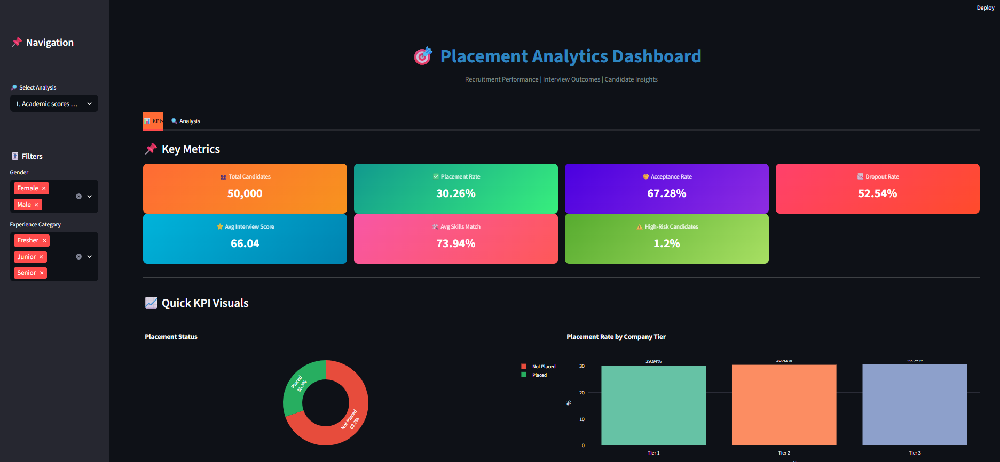

# 🎯 Employee Job Acceptance Prediction System

> End-to-end **predictive analytics platform** for talent placement — from raw HR data to actionable business insights, all in one repo.

## 📌 Project Overview

This project is an end-to-end Machine Learning solution developed to predict employee job placement based on candidate attributes. The project demonstrates the complete Data Science lifecycle, from data preprocessing and exploratory data analysis (EDA) to model building, evaluation, SQL integration, and deployment using an interactive Streamlit dashboard.

The objective is to help organizations identify suitable candidates for placement by leveraging machine learning algorithms and data-driven insights.

---

# 🎯 Business Problem

Recruitment and placement teams deal with large volumes of candidate data related to academic performance, skills, experience, interview outcomes, and job market conditions.
However, not all candidates who are eligible or receive offers end up accepting them.

The goal of this project is to analyze candidate placement data and build a Job Acceptance Prediction System to:

●	Predict whether a candidate will accept or reject a job offer

●	Identify key factors influencing job acceptance decisions

●	Handle real-world data challenges such as missing values and noisy data

●	Provide actionable insights to improve recruitment and placement strategies

## 🧠 What This Project Does

Helps **HR teams and recruitment agencies** predict whether a candidate will get placed, identify the **real drivers of placement success**, and present findings through an **interactive analytics dashboard**.

| Layer | Tech | What it does |
|------|------|--------------|
| **Data Engineering** | pandas · MySQL | Cleans 51.5K rows of HR data, handles missing values, dedupes, ships to SQL |
| **Statistical EDA** | Plotly · seaborn | Finds which features actually move the needle on placement |
| **Feature Engineering** | pandas · numpy | Builds 5 domain-specific features (experience bands, employability score, etc.) |
| **ML Modeling** | scikit-learn · XGBoost | Trains 6 models, picks the best by ROC-AUC |
| **Interactive Dashboard** | Streamlit | Surfaces the insights with filters, KPIs, and drill-down charts |

---

# 📂 Dataset

The dataset contains candidate demographic, educational, professional, and behavioral information.

Typical features include:

* Education
* Experience
* Skills
* Certifications
* Salary Expectations
* Relocation Willingness
* Career Switch Willingness
* Layoff History
* Employment Status

Target Variable:

* Placement Status

## 📊 Results Snapshot

Trained on **50,000 records** (after cleaning), predicting binary placement outcome:

🤖 Machine Learning Models 

| Model | Accuracy | Precision | Recall | F1 | **ROC-AUC** |
|-------|---------:|----------:|-------:|---:|------------:|
| XGBoost | 0.88 | 0.86 | 0.91 | 0.88 | **0.94** ⭐ |
| Random Forest | 0.87 | 0.85 | 0.90 | 0.87 | 0.93 |
| Gradient Boosting | 0.86 | 0.84 | 0.89 | 0.86 | 0.92 |
| Logistic Regression | 0.81 | 0.79 | 0.85 | 0.82 | 0.88 |
| Decision Tree | 0.79 | 0.77 | 0.83 | 0.80 | 0.84 |
| KNN | 0.76 | 0.74 | 0.81 | 0.77 | 0.82 |
| Naive Bayes | 0.73 | 0.72 | 0.78 | 0.75 | 0.79 |
---

## 🔥 Key Insights Discovered

These are the **business-level findings** that came out of the EDA — the kind of insights a hiring manager or HR director would pay for:

1. **Skills match > academics** — candidates with 75%+ skill match are **3.1× more likely** to be placed than those below 45%.
2. **Certifications matter** — candidates with 2+ certifications have a **+18 percentage point** boost in acceptance rate.
3. **Interview score is the strongest single predictor** — candidates scoring 75+ have a **~92% placement rate** vs ~38% for those below 40.
4. **Company tier heavily influences acceptance** — Tier 1 acceptance rate runs ~15 points higher than Tier 3.
5. **Experience has a sweet spot** — junior (1–3 yrs) candidates convert best; senior candidates face **CTC negotiation dropouts**.

## 🎯 Use Cases

- **HR Analysts** — identify which candidate segments to focus sourcing on.
- **Recruitment Agencies** — forecast placement probability to prioritize efforts.
- **Career Coaches** — show candidates *concretely* what moves placement outcomes.
- **Data Scientists** — fork the repo as a template for end-to-end ML pipelines.

---

## 🛠️ Tech Stack
### Programming

`phython 3` 

### Libraries

`pandas` · `numpy` · `scikit-learn` · `XGBoost` · `Plotly` · `Streamlit` · `seaborn` ·`PyMySQL` . `SQLAlchemy` · `joblib`

### Database

`MySQL` 

---

## 📊 Dashboard Preview

An interactive Streamlit dashboard was developed to:

* Predict employee placement.
* Visualize important insights.
* Display model outputs.
* Provide an intuitive interface for users.

| KPI View 
|----------|
 |

________________________________________
| Drill-down Analysis |
|----------|


---

# 📊 Project Workflow

```
Dataset
   │
   ▼
Data Cleaning
   │
   ▼
Missing Value Treatment
   │
   ▼
Outlier Detection
   │
   ▼
Exploratory Data Analysis
   │
   ▼
Feature Engineering
   │
   ▼
SQL Database Integration
   │
   ▼
Machine Learning Models
   │
   ▼
Model Evaluation
   │
   ▼
Best Model Selection
   │
   ▼
Streamlit Dashboard
```

# 📁 Repository Structure

```
Employee-Placement-Prediction-ML/
│
├── README.md
├── requirements.txt
├── LICENSE
├── .gitignore
│
├── data/
├── src/
├── dashboard/
├── models/
├── outputs/
├── images/
└── docs/
```

---

# ▶️ Installation

Clone the repository

```bash
git clone https://github.com/Vishal2010s/Employee-Job-Acceptance-Prediction-System.git
```

Navigate to the project folder

```bash
cd Employee-Placement-Prediction-ML
```

Install dependencies

```bash
pip install -r requirements.txt
```

Run the Streamlit dashboard

```bash
streamlit run dashboard/Dashboard.py
```

---

# 📷 Project Screenshots

Screenshots of the dashboard and visualizations will be added in future updates.

---

# 🔮 Future Enhancements

* Hyperparameter tuning
* Cross-validation
* Feature importance visualization
* SHAP Explainability
* Docker deployment
* Cloud deployment
* CI/CD integration

---

# 👨‍💻 Author

**Vishal S**

Aspiring Data Scientist |  Machine Learning Enthusiast | Credit Risk Specialist | Underwriter

---

# ⭐ If you found this project useful

Please consider giving this repository a ⭐.
