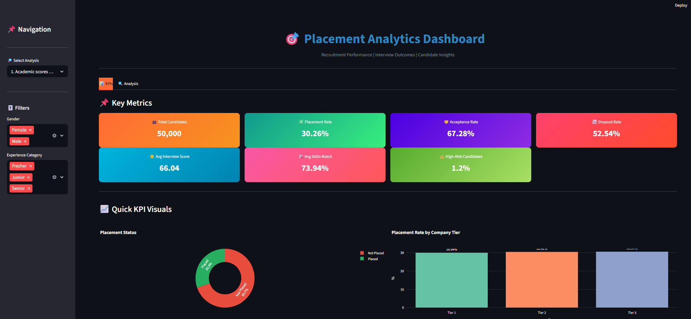
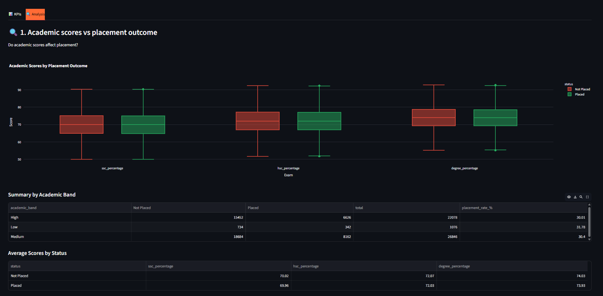
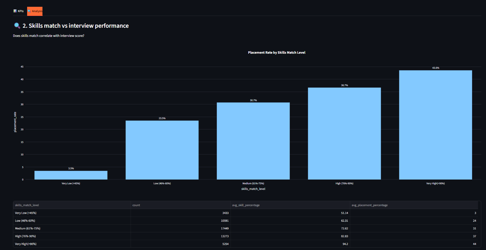
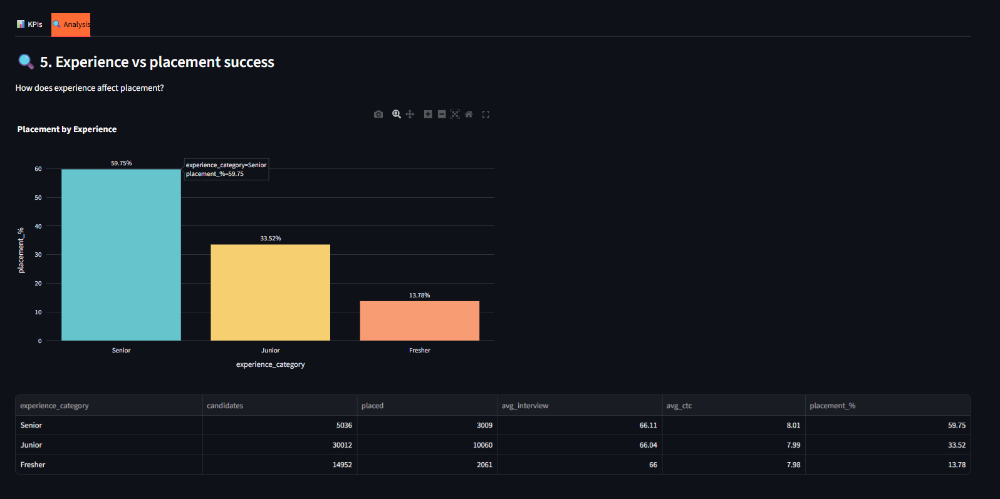
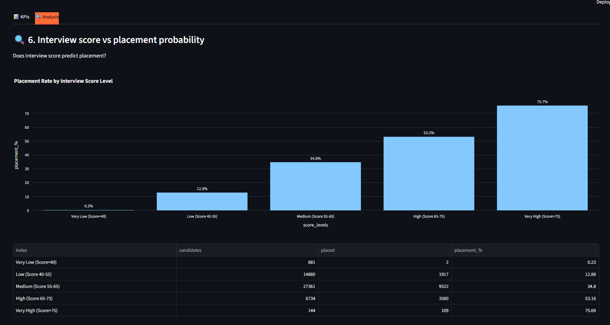
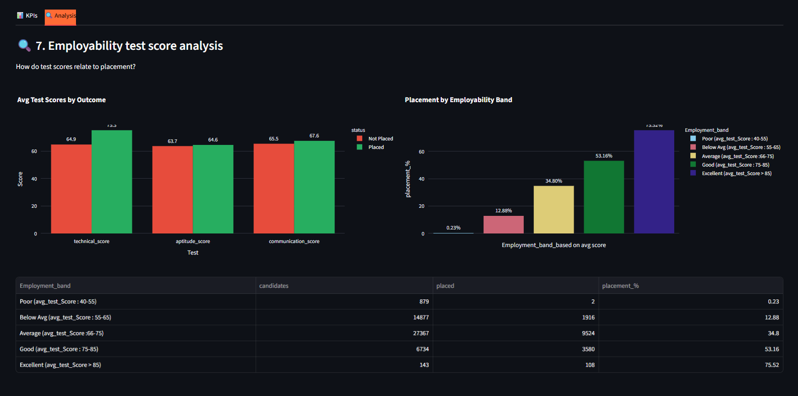
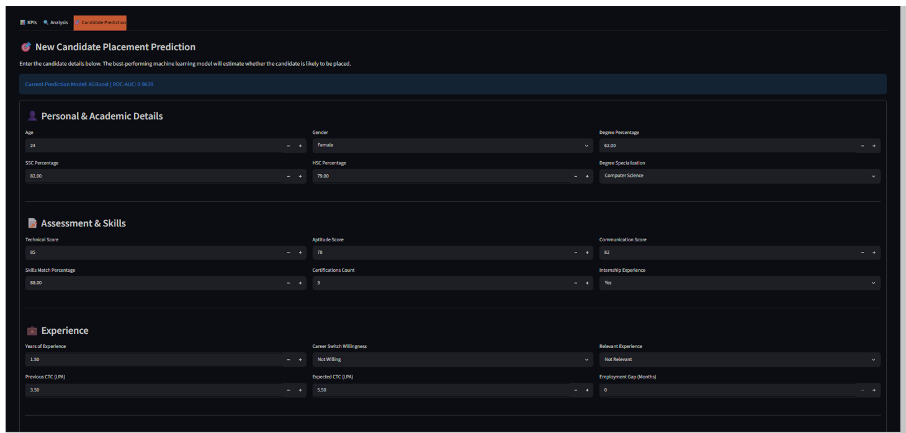
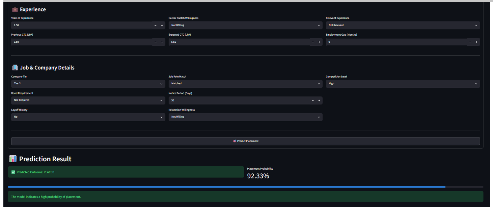

# 🎯 Employee Job Acceptance Prediction System

> End-to-end machine learning and Streamlit analytics project for candidate placement analysis, model evaluation, and new-candidate placement prediction.

## 📌 Project Overview

This project analyzes candidate academic, skill, interview, experience, and job-related attributes to understand placement outcomes and predict whether a candidate is likely to be placed.

The project covers the main Data Science workflow:

**Raw Data → Cleaning & Preprocessing → EDA → Feature Engineering → SQL Integration → Machine Learning → Model Evaluation → Streamlit Dashboard → Candidate Prediction**

The final dashboard provides KPI monitoring, drill-down analysis, interactive filters, and a prediction form for evaluating a new candidate.

---

## 🎯 Business Objective

Recruitment and placement teams handle large volumes of candidate data, but candidate suitability and final placement depend on multiple factors such as academic performance, technical ability, skills match, interview performance, work experience, salary expectations, company tier, and job-role fit.

This project is designed to:

- Analyze factors associated with candidate placement.
- Compare placement outcomes across candidate segments.
- Measure recruitment KPIs such as placement, acceptance, dropout, and high-risk candidate rates.
- Train and compare multiple classification models.
- Select the best-performing model using **ROC-AUC**.
- Predict the placement outcome and probability for a new candidate through Streamlit.

---

## 🧠 Project Components

| Component | Technology | Purpose |
|---|---|---|
| Data Cleaning & Preprocessing | Python, pandas, NumPy | Standardizes labels, removes duplicates, handles missing values, and caps outliers |
| Exploratory Data Analysis | pandas, Plotly, seaborn, matplotlib | Examines academic, skills, experience, interview, company-tier, and employability patterns |
| Feature Engineering | pandas, NumPy | Creates derived placement-related features and candidate bands |
| SQL Integration | SQLAlchemy, PyMySQL, MySQL | Uploads the processed dataset into the `project` database |
| Machine Learning | scikit-learn, XGBoost | Trains and compares six classification algorithms |
| Dashboard | Streamlit, Plotly | Displays KPIs, analysis outputs, filters, and new-candidate prediction |

---

## 📂 Dataset and Processing

The master Python program begins with the raw HR placement dataset and performs the following major operations:

1. Loads the candidate dataset.
2. Standardizes categorical labels using title-case and whitespace stripping.
3. Detects and removes duplicate rows.
4. Handles missing values using mean, median, or mode depending on the feature.
5. Detects numerical outliers using the **IQR method** and caps values to the calculated bounds.
6. Performs EDA for interview performance, skills match, company tier, experience, competition level, and correlations.
7. Creates engineered features.
8. Saves the processed dataset as `Job_accept_Final_analysis.csv`.
9. Uploads the processed data to MySQL.
10. Trains and evaluates classification models.

### Engineered Features

The pipeline creates the following placement-related features:

- `placement_rate`
- `avg_interview_score`
- `experience_category`
- `academic_band`
- `skills_match_level`
- `interview_performance`
- `placement_prob_score`

The rule-based `placement_prob_score` combines technical score, skills match, average interview score, job-role match, and company tier. The machine-learning target remains the binary `status` field (`Placed` / `Not Placed`).

---

## 🤖 Machine Learning

Six classification models are trained using an 80/20 train-test split with `random_state=42` and stratification on the target:

- Logistic Regression
- Decision Tree Classifier
- Random Forest Classifier
- XGBoost Classifier
- K-Nearest Neighbors
- Gaussian Naive Bayes

For every model, the master script calculates:

- Accuracy
- Precision
- Recall
- F1 Score
- ROC-AUC
- Classification Report

The model with the **highest ROC-AUC** is selected as the best model.

### Model Output Shown in the Project Output

In the dashboard run captured in `output.docx`, **XGBoost** was selected as the current prediction model with a **ROC-AUC of 0.9639**.

> The exact model metrics are calculated during execution from the current processed dataset. They are not hard-coded in the README.

---

# 📊 Streamlit Dashboard

The dashboard is organized into **three main tabs**:

## 1. 📊 KPIs

The KPI tab summarizes the currently filtered candidate population.

### KPI Cards

- Total Candidates
- Placement Rate
- Acceptance Rate
- Dropout Rate
- Average Interview Score
- Average Skills Match
- High-Risk Candidate Percentage

### Overall Output Snapshot

The overall dashboard output shown in `output.docx` for **Male + Female** and **Fresher + Junior + Senior** candidates is:

| KPI | Output |
|---|---:|
| Total Candidates | **50,000** |
| Placement Rate | **30.26%** |
| Acceptance Rate | **34.65%** |
| Dropout Rate | **65.35%** |
| Average Interview Score | **66.04** |
| Average Skills Match | **73.94%** |
| High-Risk Candidates | **0.01%** |

The KPI tab also contains:

- Placement Status donut chart
- Placement Rate by Company Tier bar chart
- Filtered data preview



### Interactive Filters

The sidebar supports filtering by:

- **Gender**
- **Experience Category**

This allows KPI comparison across Male/Female and Fresher/Junior/Senior candidate groups.

---

## 2. 🔍 Analysis

The Analysis tab provides seven drill-down views selected from the sidebar.

### Candidate Performance Analysis

1. **Academic Scores vs Placement Outcome**  
   Compares SSC, HSC, and degree scores for placed and not-placed candidates and summarizes placement by academic band.

2. **Skills Match vs Interview Performance**  
   Groups skills-match percentage into performance levels and compares the corresponding placement rate.

3. **Certification Impact on Job Acceptance**  
   Compares candidates with and without certifications and summarizes candidate count, placements, interview score, and job-acceptance rate.

### Placement & Acceptance Analysis

4. **Acceptance Rate by Company Tier**  
   Compares candidate volume, placements, expected CTC, and acceptance percentage across company tiers.

5. **Experience vs Placement Success**  
   Compares Fresher, Junior, and Senior groups using candidate count, placed count, interview score, expected CTC, and placement percentage.

### Interview & Evaluation Analysis

6. **Interview Score vs Placement Probability**  
   Calculates an average interview score from technical, aptitude, and communication scores and evaluates placement by score band.

7. **Employability Test Score Analysis**  
   Compares technical, aptitude, and communication scores and evaluates placement across employability bands.

### Dashboard Drill-down Screens











---

## 3. 🎯 Predict Candidate

The prediction tab allows a user to enter a new candidate's details and receive a placement prediction.

The dashboard retrains the same six model types on the processed dataset, compares their ROC-AUC values, and uses the best-performing model for prediction.

### Candidate Inputs

The prediction form collects inputs across four sections:

- **Personal & Academic Details** — age, gender, SSC %, HSC %, degree %, specialization
- **Assessment & Skills** — technical, aptitude and communication scores, skills-match %, certifications, internship experience
- **Experience** — years of experience, career-switch willingness, relevant experience, previous/expected CTC, employment gap
- **Job & Company Details** — company tier, job-role match, competition level, bond requirement, notice period, layoff history, relocation willingness

### Prediction Output

After selecting **Predict Placement**, the dashboard displays:

- Predicted outcome: **PLACED** or **NOT PLACED**
- Placement probability percentage
- Probability progress bar
- High / moderate / low probability interpretation





In the sample output captured in `output.docx`, the candidate was predicted as **PLACED** with a **92.33% placement probability**.

---

# 📊 KPI Calculation Logic

The dashboard calculates its main recruitment KPIs as follows:

- **Placement Rate** = Placed Candidates / Total Candidates × 100
- **Offered Candidates** = Candidates with `placement_prob_score >= 0.60`
- **Acceptance Rate** = Placed Candidates among Offered Candidates / Offered Candidates × 100
- **Dropout Rate** = Offered but Not Placed / Offered Candidates × 100
- **High-Risk Candidates** = Candidates with `placement_prob_score < 0.40`

These metrics are recalculated whenever the dashboard filters change.

---

# 📁 Repository Structure

```text
Employee-Job-Acceptance-Prediction-System/
│
├── dashboard/
│   └── Dashboard.py
│
├── data/
│   ├── .gitkeep
│   └── Job_accept_Final_analysis.csv
│
├── images/
│   ├── .gitkeep
│   ├── KPI_dashboard.png
│   ├── drilldown_1.png
│   ├── drilldown_2.png
│   ├── drilldown_3.png
│   ├── drilldown_4.png
│   └── drilldown_5.png
|   └── drilldown_6.png
|   └── drilldown_7.png
│
├── models/
│   └── .gitkeep
│
├── outputs/
│   └── .gitkeep
│
├── src/
│   └── Employee_Placement_Master.py
│
└── README.md
```

---

# ▶️ Python Execution

## 1. Clone the Repository

```bash
git clone https://github.com/Vishal2010s/Employee-Job-Acceptance-Prediction-System.git
cd Employee-Job-Acceptance-Prediction-System
```

## 2. Create and Activate a Virtual Environment

### Windows

```bash
python -m venv venv
venv\Scripts\activate
```

### macOS / Linux

```bash
python -m venv venv
source venv/bin/activate
```

## 3. Install Required Packages

Install the Python libraries imported by the project scripts, including:

```bash
pip install pandas numpy plotly streamlit scikit-learn xgboost sqlalchemy pymysql seaborn matplotlib joblib pdfkit
```

> `Employee_Placement_Master.py` also imports `data_profiling.ProfileReport`; ensure the corresponding package/module used in your environment is installed before executing the full master script.

## 4. Prepare the Data

The master script expects the raw file:

```text
HR_Job_Placement_Dataset.csv
```

The Streamlit dashboard uses the processed file:

```text
Job_accept_Final_analysis.csv
```

The current repository already contains the processed CSV under `data/`.

## 5. Run the Master Python Pipeline

Because the current Python files use relative CSV paths, the simplest execution approach is to run from the `data` directory when regenerating the processed file:

```bash
cd data
python ../src/Employee_Placement_Master.py
```

The script performs cleaning, EDA, feature engineering, CSV generation, MySQL upload, model training, evaluation, and best-model selection.

### MySQL Requirement

Before running the complete master pipeline, configure the MySQL connection in `Employee_Placement_Master.py` for your local environment and ensure the target database is available.

## 6. Run the Streamlit Dashboard

From the same `data` directory:

```bash
streamlit run ../dashboard/Dashboard.py
```

Then open the local Streamlit URL displayed in the terminal.

> This execution location is important with the current code because `Dashboard.py` reads `Job_accept_Final_analysis.csv` using a relative filename.

---

# 🔄 End-to-End Workflow

```text
HR_Job_Placement_Dataset.csv
          │
          ▼
Data Understanding
          │
          ▼
Categorical Label Standardization
          │
          ▼
Duplicate Removal
          │
          ▼
Missing Value Imputation
          │
          ▼
Outlier Detection & Capping
          │
          ▼
Exploratory Data Analysis
          │
          ▼
Feature Engineering
          │
          ▼
Job_accept_Final_analysis.csv
          │
          ├──────────────► MySQL Database
          │
          ▼
ML Training: LR / DT / RF / XGB / KNN / NB
          │
          ▼
Model Evaluation
          │
          ▼
Best Model by ROC-AUC
          │
          ▼
Streamlit Dashboard
          │
          ├── 📊 KPIs
          ├── 🔍 Analysis
          └── 🎯 Predict Candidate
```

---

## 🎯 Use Cases

- Recruitment KPI monitoring
- Candidate-segment comparison
- Placement-driver analysis
- Job-acceptance analysis
- Candidate placement-probability estimation
- Demonstration of an end-to-end Data Science and Machine Learning workflow

---

## 🛠️ Tech Stack

**Programming:** Python 3  
**Data Analysis:** pandas, NumPy  
**Visualization:** Plotly, seaborn, matplotlib  
**Machine Learning:** scikit-learn, XGBoost  
**Database:** MySQL, SQLAlchemy, PyMySQL  
**Dashboard:** Streamlit  
**Model Utilities:** joblib

---

## 👨‍💻 Author

**Vishal S**  
Aspiring Data Scientist | Machine Learning Enthusiast | Credit Risk Specialist | Underwriter

---

## ⭐ Project Note

This repository demonstrates the complete transition from candidate-level raw data to cleaned analytical data, business KPIs, machine-learning model comparison, and an interactive prediction dashboard.
